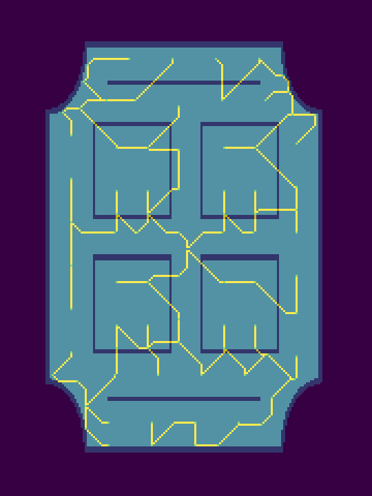
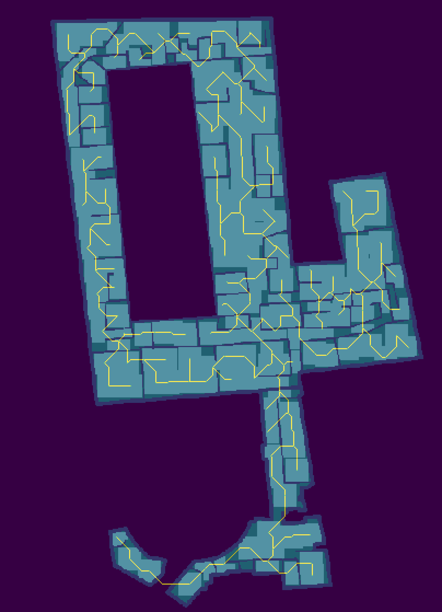

# Google \#Hash Code 2017 Final Round

Solutions and code for the [Google \#Hash Code 2017 Challenge](https://hashcode.withgoogle.com) **"Router placement"** of our Team _Gyrating Flibbittygibbitts_.

The problem statement can be found [here](hashcode2017_router_placement.pdf).

The input files can be found in [`input/`](input/)
* [Charleston road](input/charleston_road.in)
* [Let's go higher](input/lets_go_higher.in)
* [Opera](input/opera.in)
* [Rue de Londres](input/rue_de_londres.in)

> Who doesn't love wireless Internet?
> Millions of people rely on it for productivity and fun in countless cafes, railway stations and public areas of all sorts.
> For many institutions, ensuring wireless Internet access is now almost as important a feature of building facilities as the access to water and electricity.
> Typically, buildings are connected to the Internet using a fiber backbone.
> In order to provide wireless Internet access, wireless routers are placed around the building and connected using fiber cables to the backbone.
> The larger and more complex the building, the harder it is to pick router locations and decide how to lay down the connecting cables.
>
> _from [Problem statement for Final Round, Google \#Hash Code 2017](https://hashcode.withgoogle.com/past_editions.html)_

## Algorithm
tba.

If you have questions about the used algorithms (etc.) please feel free and ask, just open an issue!

## Scores
Overall **539,090,345** points.

Highest score during the _Final Round_ was 548,065,447 points (Team _AIM Tech_), and 550,156,575 points (Team _The Skyrmions_) in the _Extended round_.

#### Charleston road
_`21,962,365`_ points in `376.92s`.

#### Let's go higher
_`290,118,862`_ points in `6488.64s`.

#### Opera
_`170,046,013`_ points in `2067.48s`.

#### Rue de Londres
_`56,963,105`_ points in `1399.57s`.

## Authors

Sebastian Brodehl / [@sbrodehl](https://github.com/sbrodehl)

Alexej Disterhoft / [@nobbs](https://github.com/nobbs)

Dennis Meyer / [@snakebite1457](https://github.com/snakebite1457)
